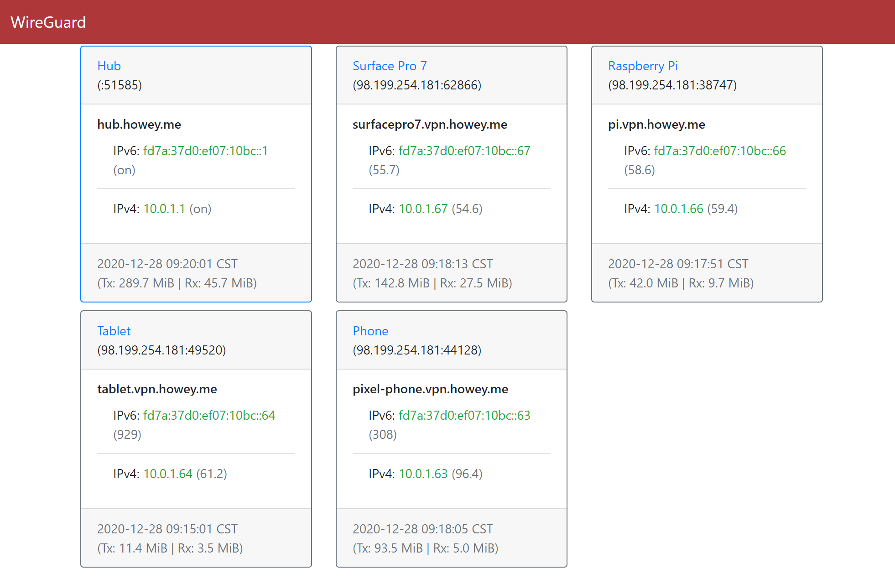

# WGDash

Wireguard dashboard page showing the latest stats for all peers.

### Requirements

- Linux
    - wg tools (wg <dev> show dump)
    - ip (ip -s -j address)
    - ping (ping -c 1 -i 1 -W 1 <peer ip>)

Usage (Run as root or sudo):
```sh
wgdash --config config.toml -o wgdashboard.html
```

Example dashboard


